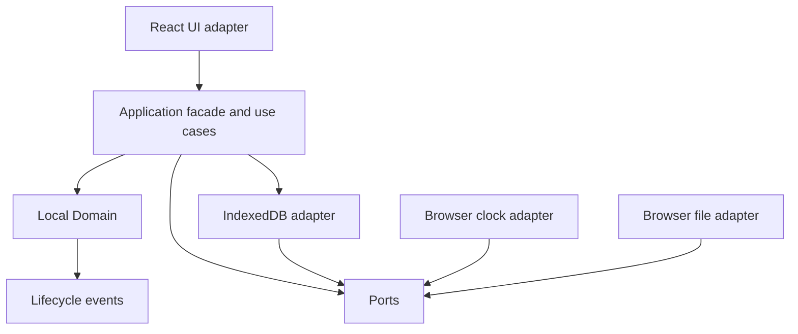
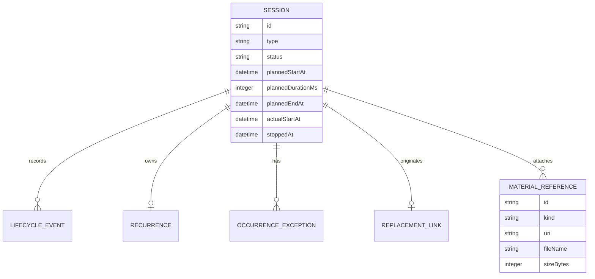

# Architecture Spine — Study AI Local-First MVP

## Design Paradigm

A lean hexagonal modular monolith runs in a browser-first local runtime. The domain owns Session lifecycle, timing, recurrence, replacements, history, and material relationships. Application use cases orchestrate domain mutations. UI and browser storage are adapters behind ports.

Dependency direction:



Adapters may depend on application ports; domain code does not depend on React, IndexedDB, browser timers, or file APIs.

## Invariants & Rules

### AD-1 — Local Domain owns study truth [ADOPTED]

- **Binds:** all Session capabilities and FR-1 through FR-15
- **Prevents:** UI, persistence, or external content creating competing lifecycle rules
- **Rule:** Session status, timing rules, tolerance, completion, loss, recurrence, replacement, and history are decided by the Local Domain through application use cases.

### AD-2 — Mutations use explicit use cases [ADOPTED]

- **Binds:** Start, Stop, replacement, recurrence exceptions, import, and all state-changing flows
- **Prevents:** screens, timer displays, or import code mutating entities directly
- **Rule:** Every application query and mutation enters through an application facade. The facade reconciles and persists affected Sessions before reading the state used by the operation; mutations invoke a domain transition and persist current state plus lifecycle events in one IndexedDB transaction.

### AD-3 — Persist facts, derive time [ADOPTED]

- **Binds:** FR-5 through FR-8, FR-10, FR-14, timer recovery
- **Prevents:** an in-memory interval becoming the source of timer truth
- **Rule:** Persist plannedStartAt, plannedDuration, plannedEndAt, actualStartAt, stoppedAt when present, and status. Persist event timestamps with millisecond precision from the Clock snapshot at commit. Derive elapsed and remaining time from an injected Clock; the UI shows both.

### AD-4 — Tolerance is global and equals 50% of duration [ADOPTED]

- **Binds:** FR-6, FR-9, FR-10, FR-13, Managed Lessons, and Free Blocks
- **Prevents:** a Session starting when less than the required valid study time remains
- **Rule:** `toleranceDeadline = plannedStartAt + (plannedDuration * 0.5)`. At or after the boundary, a Pending Session is reconciled to Lost and Start is blocked. Use precise time values; do not round to whole minutes.

### AD-5 — Planned end is never extended [ADOPTED]

- **Binds:** FR-7, FR-8, FR-10
- **Prevents:** late arrival silently compensating scheduled time
- **Rule:** `plannedEndAt = plannedStartAt + plannedDuration`. A late start records actualStartAt but never changes plannedEndAt.

### AD-6 — Start and Stop are idempotent [ADOPTED]

- **Binds:** FR-5, FR-8, FR-10
- **Prevents:** duplicate starts, duplicate stops, and duplicate lifecycle events
- **Rule:** Start is valid only for Pending within tolerance and never overwrites actualStartAt. Stop is valid only for Started. Repeated operations return current state without a second transition. A single active browser tab is assumed; cross-tab coordination is deferred.

### AD-7 — Reconcile on observation and mutation [ADOPTED]

- **Binds:** FR-1, FR-2, FR-6, FR-8, FR-13, FR-14, UJ-1 through UJ-4
- **Prevents:** stale Pending or Started state after tab closure, browser suspension, or process restart
- **Rule:** Reconcile Sessions on application open, focus, and before every application query or mutation. Reconciliation completes and persists terminal transitions before the operation reads current state. A browser interval may refresh display only; it cannot establish domain truth.

### AD-8 — Preserve lifecycle history [ADOPTED]

- **Binds:** FR-9, FR-14, FR-15, UJ-4
- **Prevents:** replacements or manual adjustments erasing the original Session outcome
- **Rule:** Persist current Session state with append-only lifecycle events in one consistency boundary. A Replacement stores an immutable originatingSessionId; imports reject dangling or cyclic replacement references. The original Lost history remains auditable.

### AD-9 — IndexedDB is behind the persistence port [ADOPTED]

- **Binds:** FR-14, local operation, backup and recovery
- **Prevents:** domain and application code coupling to browser storage APIs
- **Rule:** IndexedDB adapter owns schema/version migrations and transactions. Domain and application layers use persistence ports only.

### AD-10 — Materials are explicit and inert [ADOPTED]

- **Binds:** FR-12, material references, local file access
- **Prevents:** automatic filesystem scanning, arbitrary path access, or executing attached content
- **Rule:** External links store validated `http`/`https` URLs and metadata. Local files enter only through explicit browser selection; blobs up to 5 MB per file may be stored in IndexedDB, while larger files retain metadata and require reselection. Material validation occurs before storage. Material failures never mutate Session status.

### AD-11 — Import is validate-before-replace [ADOPTED]

- **Binds:** backup and recovery, FR-14
- **Prevents:** partial or invalid backup imports corrupting local state
- **Rule:** Export/import uses versioned JSON with stable IDs and timestamps. Validate the complete document, schema version, duplicate IDs, material limits, and replacement references for dangling or cyclic links before atomically replacing all local state. Import never merges with existing state.

### AD-12 — No external service in the MVP [ADOPTED]

- **Binds:** local operation, privacy, MVP scope
- **Prevents:** hidden network, authorization, synchronization, or notification dependencies
- **Rule:** Core Session creation, timing, history, recovery, and review work without network access, OAuth, Google Calendar, browser notifications, operating-system notifications, or external reminder services.

## Consistency Conventions

| Concern | Convention |
| --- | --- |
| Naming | TypeScript names use descriptive PascalCase for domain types and camelCase for fields/use cases. Use stable IDs for Sessions, lifecycle events, replacements, recurrences, and materials. |
| Data & formats | Store timestamps as ISO 8601 UTC values; represent durations as integer milliseconds; include `schemaVersion` in exported JSON; validate URLs and imported records at boundaries. |
| State & cross-cutting | Only use cases mutate state. Inject Clock and persistence ports. Reconciliation precedes mutation. Persistence failures are returned as actionable errors and never reported as successful commits. |

## Stack

| Name | Version |
| --- | --- |
| TypeScript | current project-selected version |
| React | current project-selected version |
| Vite | Vite 7 documentation / `create vite@latest` starter |
| Browser persistence | IndexedDB API, browser-provided |

## Structural Seed

```text
src/
  domain/          # Session entities, value objects, transitions, lifecycle events
  application/     # use cases, Clock and persistence ports, DTO mapping
  adapters/
    persistence/   # IndexedDB schema, migrations, transactions
    browser/       # Clock, file selection, safe URL opening
  ui/              # React components, screens, view models, accessibility
  shared/          # stable IDs, time/date utilities, error primitives
```



Operational envelope: local build/dev server serves the browser app; no backend or external provider is required for MVP operation. IndexedDB is initialized before persisted data is rendered. Exported JSON is the recovery boundary.

## Capability → Architecture Map

| Capability / Area | Lives in | Governed by |
| --- | --- | --- |
| Next Session and daily agenda | application queries + React UI | AD-1, AD-7 |
| Managed Lesson lifecycle | domain transitions + use cases | AD-1 through AD-7 |
| Free Block timing and recurrence | domain transitions + recurrence module | AD-1, AD-4, AD-5, AD-7 |
| Materials and external access | material port + browser adapter | AD-10 |
| Local persistence and history | persistence port + IndexedDB adapter | AD-2, AD-8, AD-9 |
| Backup and restore | application use cases + persistence adapter | AD-11 |
| Accessibility and desktop UX | React UI adapter | UX `DESIGN.md` and `EXPERIENCE.md`; AD-1 |

## Deferred

- Exact TypeScript and React versions, until the project starter is created and pinned.
- IndexedDB library choice, if any; native API or a thin wrapper can be selected during implementation without changing the port.
- Exact IndexedDB store names and indexes; code owns schema detail under AD-9.
- Cross-tab coordination; MVP assumes one active browser tab.
- Browser storage quota and eviction UX beyond export/recovery flows.
- Supported-browser matrix and browser-specific storage behavior, to be validated before implementation release.
- Exact default UI route structure and component library.
- Week-view expansion, mobile responsiveness, Google Calendar, notifications, OAuth, synchronization, and other external integrations.
- Test framework and exact test file layout, provided tests cover domain transitions, persistence adapters, import/export, and UI flows.
